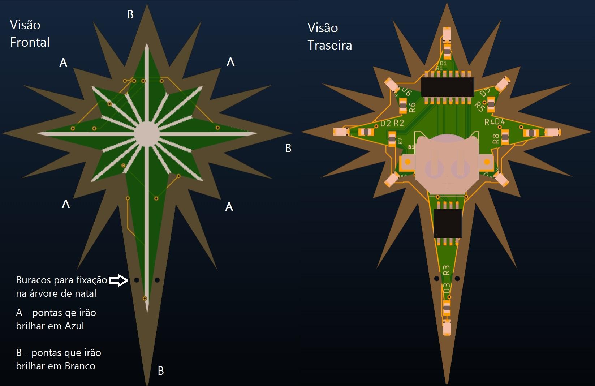
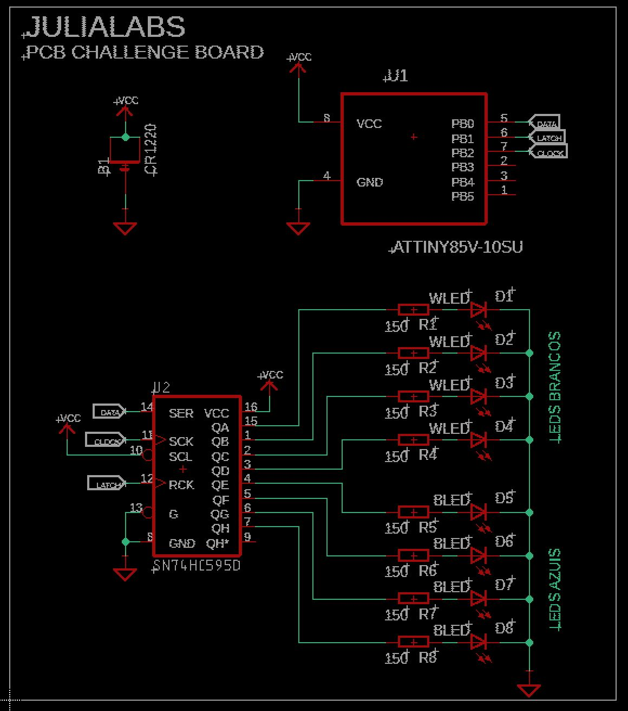
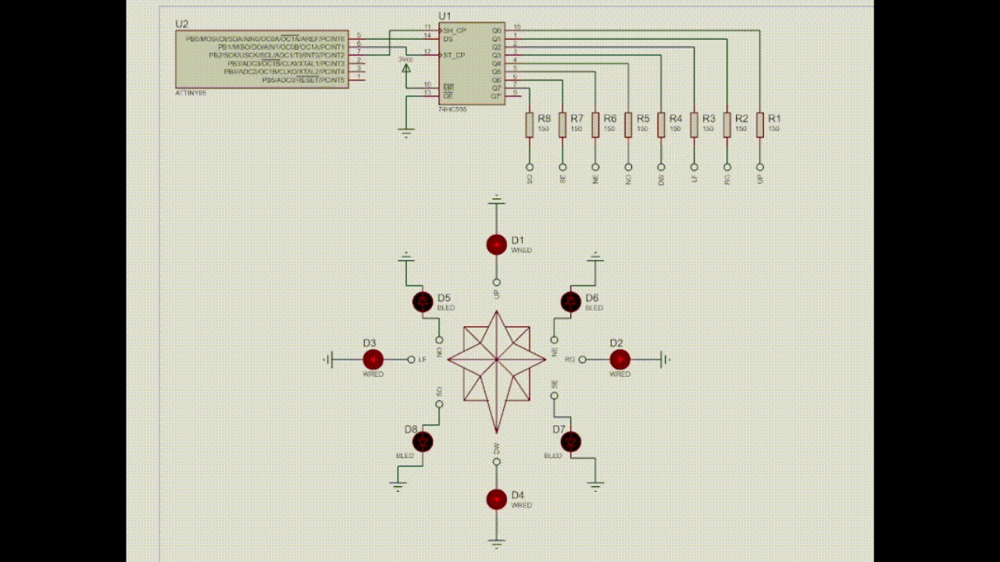

# Xmas2021-JuliaLabs-PCB-Challenge

## Descrição Geral
Esta placa foi desenvolvida para o concurso "Julialabs PCB Challenge" de 2021 com um tema natalino.
A idéia geral foi fazer um enfeite de para a árvore de natal (a estrela que normalmente é colocada no topo da árvore) que funcione de maneira automática (ao inserir a bateria) fazendo sequências "pisca-pisca" nas pontas principais da mesma (inclusive há buracos na parte interior da placa para se passar uma fita ou linha para afixar a placa na árvore de natal!)
### Funcionamento
Para funcionar ela só precisará de uma bateria 3V tipo CR1220 (facilmente encontrada - a famosa "bateria de relógio") para iniciar automaticamente a apresentação de uma sequências de acendimento de LEDs predefinidos (por software) que destacam os oito cantos principais da estrela.
As sequências (não necessarimanete nesta ordem) são:
-  Alternando os 4 cantos internos (LEDs azuis) e os 4 cantos externos (LEDs brancos)
- Fazendo uma volta completa  piscando no sentido horário e anti-horário
- Piscando todos os Leds acesos e apagados entre estas sequências.

### Hardware
O Hardware foi desenvolvido usando o software [Eagle](https://github.com/vilelalabs/Xmas2021-JuliaLabs-PCB-Challenge/tree/master/HARDWARE/eagle), incluindo aqui:
- O esquemático
- A placa de circuito impresso
- O arquivo gerber para fabricação. 

Já a simulação do funcionamento do circuito foi realizada utilizando o software [Proteus](https://github.com/vilelalabs/Xmas2021-JuliaLabs-PCB-Challenge/tree/master/HARDWARE/proteus).

**_Todos os arquivos referentes ao desenvolvimento do Hardware se encontram na pasta [HARDWARE](https://github.com/vilelalabs/Xmas2021-JuliaLabs-PCB-Challenge/tree/master/HARDWARE)_**

### Software / Firmware
- O software foi desenvolvido em C++ usando PlatformIO para VSCode IDE. Nele temos macros (#define) para cada led individualmente e para grupos dos leds (por cor, ou considerandos todos os leds simultaneamente). O código principal pode ser encontrado na pasta [SRC](https://github.com/vilelalabs/Xmas2021-JuliaLabs-PCB-Challenge/tree/master/SOFTWARE/src).
Foram usados encapsulamentos SOIC e componentes SMD de solda manual fácil para uma experiência fácil também na montagem.

**_Todos arquivos referentes ao desenvolvimento do software no PlatformIO estão na pasta [SOFTWARE](https://github.com/vilelalabs/Xmas2021-JuliaLabs-PCB-Challenge/tree/master/SOFTWARE)_**

### Observações
- Os LEDs devem ser colocados lateralmente (virados para as mesmas direções) ou, se possível, com uma orientação para o lado interno da placa (que poderia ser possível com um "ajuste" na hora da soldagem) aproveitando melhor as partes translúcidas da placa.
- Todo o processo foi transmitido em stream na [Twitch](https://twitch.tv/vilelalabs) e parte desse desenvolvimento será destacado no [Youtube](https://youtube.com/vilelalabs) futuramente.

### Imagens
|Placa|Esquemático|
|:----------:|:----------:|
|   |  |
|Visualização 3D|Simulação|
|   |  |

### Lista de Componentes
|Componente|Quantidade|Observação| Datasheet|
|:----------:|:----------:|:----------:|:----------:|
| [ATTINY85V-10SUR](https://br.mouser.com/ProductDetail/556-ATTINY85V-10SUR)  | 1  | Microcontrolador  | [Datasheet](https://br.mouser.com/datasheet/2/268/Atmel-2586-AVR-8-bit-Microcontroller-ATtiny25-ATti-1315542.pdf)|
| [SN74HC595D](https://br.mouser.com/ProductDetail/595-SN74HC595DRE4)  | 1  | Registrador de deslocamento de 8 bits  | [Datasheet](https://www.ti.com/lit/ds/symlink/sn74hc595.pdf?HQS=dis-mous-null-mousermode-dsf-pf-null-wwe&ts=1641509615811&ref_url=https%253A%252F%252Fwww.mouser.be%252F)|
| [Clip de Bateria CR1220](https://br.mouser.com/ProductDetail/534-3000TR)  | 1  | Modelo Keystone 3000TR | [Datasheet](https://br.mouser.com/datasheet/2/215/3000TR-742873.pdf)|
| [Resistor 150Ω](https://br.mouser.com/ProductDetail/71-TNPW0805150RFEEA)  | 8  | Observacao  | [Datasheet](https://br.mouser.com/datasheet/2/427/tnpw_e3-1761965.pdf)|
| [LED Branco](https://br.mouser.com/ProductDetail/720-LWA67CS2U25K8LZ)  | 4  | montagem lateral / SMD  |[Datasheet](https://dammedia.osram.info/media/resource/hires/osram-dam-6455804/LW%20A67C%20binning%20FK0PN0_EN.pdf)|
| [LED Azul](https://br.mouser.com/ProductDetail/859-LTST-S220TBKT)  | 4  | montagem lateral / SMD  |[Datasheet](https://br.mouser.com/datasheet/2/239/Lite-On-LTST-S220TBKT-1175488.pdf)|

### Links
- [Carrinho de compras na Mouser](https://br.mouser.com/ProjectManager/ProjectDetail.aspx?AccessID=4d0b96b75f)
- [Projeto na PCBWay](https://www.pcbway.com/project/shareproject/Blinking_Christmas_Star_e158be5a.html)
